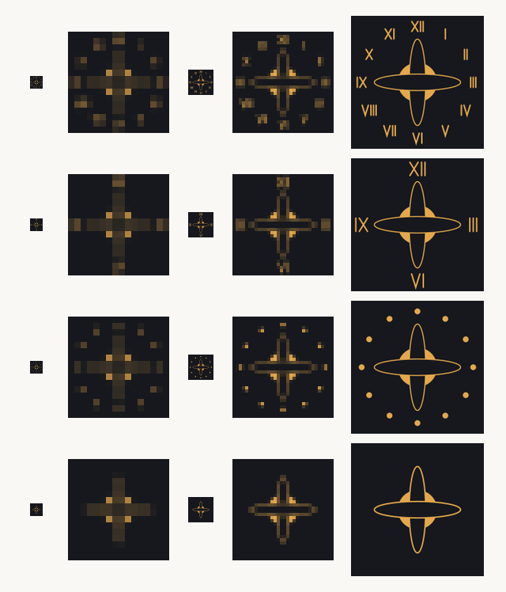
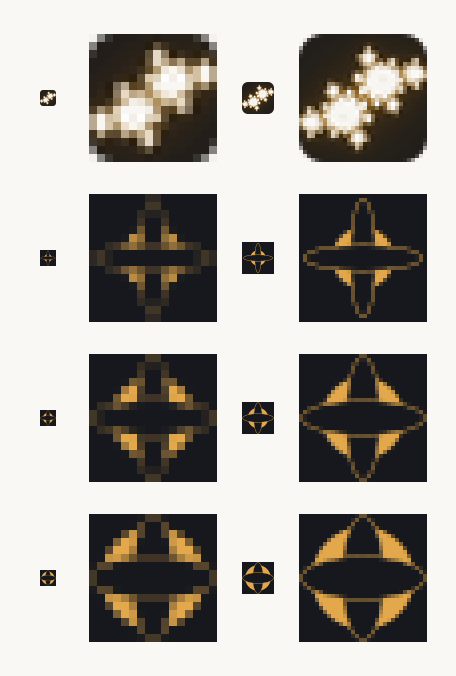

# Can the armillary sphere become the favicon?

A study of whether the motif on the reference book cover — a gold sphere crossed
by two orbital rings, ringed by the twelve hours in Roman numerals — can replace
the Julia set currently used as the site mark.

The motif is a good fit on subject alone. Celestial mechanics is where the
differential equations this site is about actually came from, and a dial makes
the same promise the posts do: that something continuous can be read off exactly.
None of that helps if it cannot be seen at sixteen pixels, which is the size a
favicon is nearly always met at.

## Method

Proportions were measured off the photograph rather than invented, so that the
first pass tests the reference itself and not a more convenient thing standing in
for it. As fractions of the cover's width:

| Element | Measurement |
| --- | --- |
| Sphere radius | 0.148 |
| Ring short axis | 0.060, or 0.42 × the sphere's radius |
| Ring long axis | 0.325, or 2.20 × the sphere's diameter |
| Numeral ring radius | 0.42 |

One detail turned out to matter more than any other. The rings on the cover are
**not** open outlines over the sphere: they are filled with the background and
drawn on top, cutting two bands out of the gold. That occlusion is a shape rather
than a hairline, and shapes survive reduction in a way hairlines do not.

Every size was rasterised from the vector at that size rather than downsampled
from one large render. This is the most favourable treatment the artwork can be
given, so anything that fails under it fails everywhere. Magnified columns in the
figures use nearest-neighbour, so what is shown is the pixels themselves.

Roman numerals were drawn as stroked paths rather than set as type. A dial uses
only I, V and X, all three of them straight lines, so this removes any dependence
on which fonts the rasteriser happens to find.

## Finding 1: the dial cannot come along

*Rows: all twelve hours; four hours only; hours as dots; no dial. Columns: 16px,
16px magnified, 32px, 32px magnified, 180px.*

At 180 pixels the full design is excellent, and it is worth saying plainly that
nothing below is a criticism of it. At 32 the numerals are already illegible
smudges, and at 16 they are indistinguishable from noise — they do not merely
become hard to read, they actively muddy the tile, because twelve grey specks
around the rim read as dirt rather than as ornament.

Cutting to four hours does not rescue it: at 16 pixels a numeral has about two
pixels of height to work with, and no amount of enlargement inside that budget
buys legibility. Replacing the hours with dots is the only version that fails
gracefully, but the dots contribute nothing at 16 either.

The dial therefore has to go entirely below roughly 64 pixels. Since 16 and 32
are the sizes that matter most, it has to go.

## Finding 2: presence is the real problem, not detail

With the dial removed, the sphere and its two rings do survive — but drawn at the
cover's proportions the mark occupies a small cross in the middle of a mostly
empty tile, and an empty tile is an invisible one in a crowded tab strip.

*Rows: the mark in use, then the armillary with the sphere at 0.24, 0.32 and 0.40
of the tile. Columns: 16px, 16px magnified ×8, 32px, 32px magnified ×4.*

The mark now in use fills its tile with bright, warm pixels edge to edge. The
armillary at the cover's scale does not, and beside it looks faint. Growing the
sphere fixes this: at 0.40 the tile carries enough gold to hold its own, and at
32 pixels it still reads unmistakably as a sphere with two bands around it.

*The current mark above, the armillary at 0.40 below, on light and dark chrome.*

Both are perfectly serviceable in a tab. The armillary is the cleaner and more
geometric of the two; the Julia set is warmer and more textured.

## Finding 3: fidelity and presence pull against each other

Growing the sphere is not free, and this is the finding that should decide the
question.

*Sphere at 0.148 (the cover's own scale), 0.20, 0.24, 0.28 and 0.32 of the tile.*

On the cover the rings extend to 2.2× the sphere's diameter, and that long reach
is what makes the thing read as an armillary sphere — rings on an axis, passing
around a body — rather than as a ball with stripes. A square tile cannot hold
both a large sphere and rings reaching 2.2× beyond it. As the sphere grows the
ratio collapses:

| Sphere | Ring reach | Reads as |
| --- | --- | --- |
| 0.148 | 2.20× (the cover) | armillary sphere, but faint at small sizes |
| 0.20 | 2.20× | armillary sphere, noticeably more present |
| 0.24 | 1.92× | armillary sphere |
| 0.32 | 1.50× | a banded sphere |
| 0.40 | 1.20× | a wrapped ball |

So the version that is strongest at 16 pixels is the one that has stopped being
the motif, and the version faithful to the cover is the one that disappears in a
tab strip. That tension is inherent to the design, not to this execution of it.

There is also a hazard worth naming: below about 24 pixels every variant here
resolves to a four-pointed star, which is now the near-universal icon for "AI".
It is a recognisable shape, but it is recognisable as something else.

## Options

**Two drawings, one mark.** Ship the faithful proportions at 180, 192 and 512,
and a bolder simplification at 16 and 32. This is ordinary practice for icon
families and it is the only way to get both properties. The cost is that the two
drawings do not resemble each other closely, since what separates them is exactly
the ring reach that gives the motif its character.

**One drawing, at sphere 0.32.** A single compromise: present enough at 16,
still legible as a sphere with rings at 32, though the rings are visibly stubbier
than the cover's. Simplest to build and maintain.

**Keep the Julia set.** It is brighter at 16 pixels, it is already drawn from the
site's own tokens along the same cividis-adjacent ramp the figures use, and it is
mathematics the site actually discusses rather than a picture of an instrument.
The armillary's advantage is that it is more legible as an object; its
disadvantage is everything in Finding 3.

## Recommendation

If the motif is wanted, take **two drawings, one mark**, with the large sizes at
sphere 0.20 — which holds the cover's 2.2× reach while filling the tile better
than the cover's own 0.148 — and the small sizes at 0.40.

If a single drawing is required, 0.32 is the place to stand.

If neither of those trade-offs is attractive, the honest conclusion is that this
motif belongs at large sizes: it would make an excellent header illustration, an
`apple-touch-icon`, or the mark on the social cards, while the tab keeps a shape
built to survive sixteen pixels.

## Decision

The Julia set stays. It is brighter at the size a favicon is actually seen at, it
is drawn from the site's own tokens along the ramp the figures already use, and
it is mathematics the site discusses rather than a picture of an instrument. The
armillary's one clear advantage — being legible as an object — is not worth the
trade in Finding 3.

## If this is ever revisited

The generating script was a throwaway and is not kept, but everything needed to
redraw the variants is above. The construction is four shapes on a tile: a filled
`--conjecture` circle centred on an `--ink` ground, then two ellipses filled with
`--ink` and outlined in `--conjecture`, one the transpose of the other. Ring
short axis is 0.42 × the sphere's radius at every scale; the sphere radius and
ring long axis are what the variants vary. Stroke width of 0.012 × the tile held
up across sizes.

The one thing not to lose: the rings are filled, not open. Drawing them as plain
outlines over the sphere loses the motif below 32 pixels, because the hairline
goes and nothing is left in its place.
